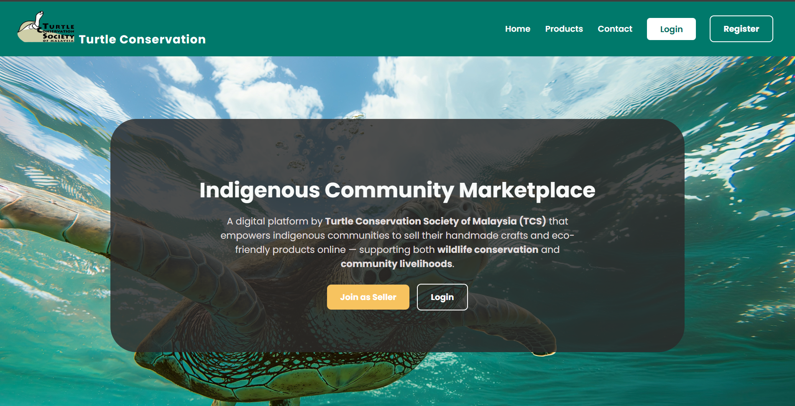
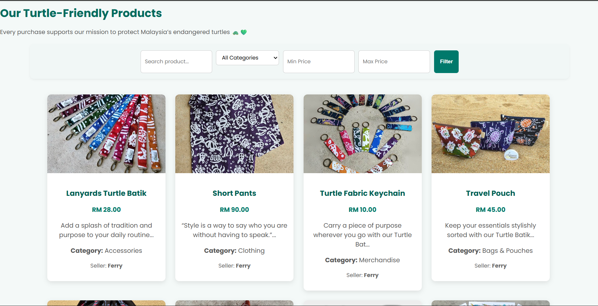
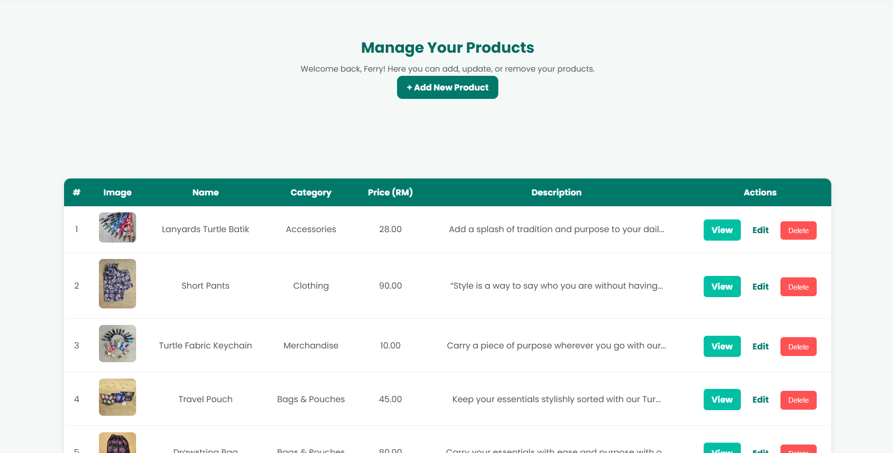
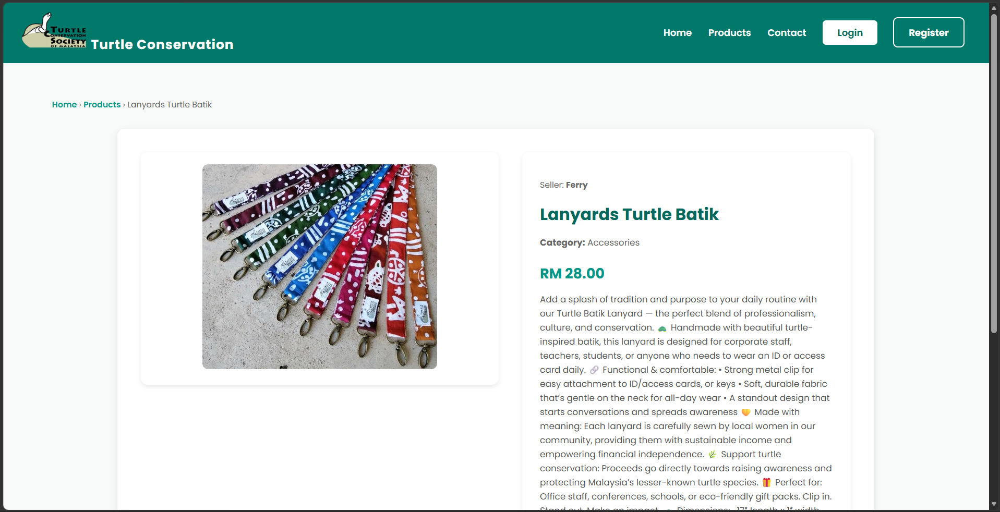
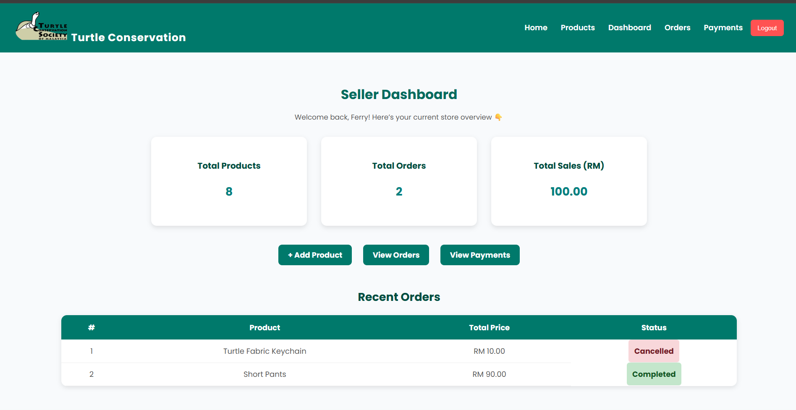

# Indigenous Community Marketplace

A web-based marketplace application developed using **Laravel, PHP and MySQL** as an academic project.

The system is designed to support the sale of eco-friendly and turtle-themed products from local and indigenous communities while providing separate features for public users, buyers and sellers.

## 🛍️ Overview

The Indigenous Community Marketplace provides a platform where users can browse products, search and filter items, place orders and manage purchases.

Sellers can manage their products, monitor orders and review payment information through dedicated seller features.

The system was developed as part of my **Diploma in Computer Science** studies at **Kolej Profesional MARA Beranang (KPM)**.

## 👥 User Roles

### 🌐 Public User

- Browse available products
- Search for products
- Filter products by category
- View product details
- Register and log in

### 🛒 Buyer

- Browse and search products
- View product details
- Place orders
- Upload payment receipts
- View order information
- Manage purchases

### 🏪 Seller

- Access seller dashboard
- Add new products
- Edit products
- Delete products
- Manage product information
- View customer orders
- Manage payment information
- Review uploaded payment receipts

## ✨ Features

### 🔍 Product Browsing

- Product listing
- Product search
- Category filtering
- Product detail pages
- Product images and information

### 📦 Product Management

Sellers can perform CRUD operations on their products:

- Create products
- Read product information
- Update products
- Delete products

### 🛒 Order Management

- Buyers can place orders for products
- Order information is recorded in the system
- Sellers can view customer orders
- Buyers can view their order information

### 💳 Payment Management

- Buyers can upload payment receipts
- Payment information is stored in the system
- Sellers can review uploaded payment receipts

### 👤 Authentication & Roles

- User registration
- User login
- Role-based features
- Separate buyer and seller interfaces

## 📸 Screenshots

### 🏠 Homepage



### 🛍️ Product Catalog



### 📦 Product Management



### 🔎 Product Details



### 🏪 Seller Dashboard



## 🛠️ Technologies

| Technology | Purpose |
|------------|---------|
| **Laravel** | Web application framework |
| **PHP** | Backend development |
| **MySQL** | Database management |
| **HTML** | Web page structure |
| **CSS** | User interface styling |
| **JavaScript** | Client-side functionality |
| **Blade** | Laravel templating engine |
| **XAMPP** | Local development environment |
| **Composer** | PHP dependency management |

## 🗄️ Database

The system uses MySQL as the database management system.

Main database entities include:

- Users
- Products
- Orders
- Payments

These entities support user management, product management, order processing and payment information.

## 📂 Project Structure

```text
app/
├── Http/
│   └── Controllers/
├── Models/
└── ...

database/
├── migrations/
└── ...

public/
├── images/
│   ├── products/
│   └── screenshots/
└── ...

resources/
├── views/
├── css/
└── js/

routes/
└── web.php

storage/
vendor/
.env
```

## 🚀 Getting Started

### Prerequisites

Before running the project, make sure you have:

- PHP
- Composer
- MySQL
- XAMPP
- Node.js and npm

### 1. Clone the Repository

```bash
git clone https://github.com/ferryyirwan/indigenous-community-marketplace.git
```

### 2. Navigate to the Project

```bash
cd indigenous-community-marketplace
```

### 3. Install PHP Dependencies

```bash
composer install
```

### 4. Install Frontend Dependencies

```bash
npm install
```

### 5. Configure Environment

Create a `.env` file based on the example configuration:

```bash
cp .env.example .env
```

Configure the database connection in `.env`:

```env
DB_DATABASE=your_database_name
DB_USERNAME=your_username
DB_PASSWORD=your_password
```

### 6. Generate Application Key

```bash
php artisan key:generate
```

### 7. Run Database Migrations

```bash
php artisan migrate
```

### 8. Start the Development Server

```bash
php artisan serve
```

The application can then be accessed through the Laravel development server.

## 🎯 Project Objectives

The main objectives of this project are to:

- Develop a web-based marketplace system
- Provide a platform for product browsing and purchasing
- Support product management for sellers
- Implement buyer and seller roles
- Manage orders and payment information
- Apply Laravel, PHP and MySQL in a practical application

## 📚 Project Highlights

Through the development of this project, I gained hands-on experience in:

- Laravel web application development
- PHP backend development
- MySQL database design
- CRUD operations
- Authentication and role-based functionality
- MVC architecture
- Blade templating
- Form handling and validation
- Order management
- Payment receipt handling
- Web application testing and debugging

## 👨‍💻 Developer

**Ferry Irwan**

Diploma in Computer Science  
Kolej Profesional MARA Beranang (KPM)

### 🔗 Links

- GitHub: [@ferryyirwan](https://github.com/ferryyirwan)
- LinkedIn: [Ferry Irwan](https://www.linkedin.com/in/ferry-irwan-889b25428)

---

⭐ This project was developed as part of my academic journey in Computer Science.
